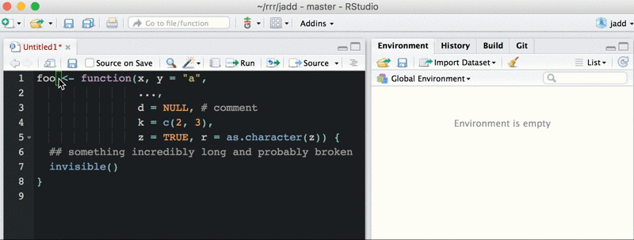

## RStudio addins

RStudio addins let you bundle up a bit of R code or a Shiny app and then execute
it via the RStudio IDE, either via the Addins dropdown menu or with a keyboard 
shortcut. Coupled with functions from the `rstudioapi` package, this means you 
can operate on your own R code, which is awesome.

RStudio docs on addins (with examples): 
<https://rstudio.github.io/rstudioaddins/>

I was inspired by TJ Mahr's recent [WrapRmd 
addin](https://github.com/tjmahr/WrapRmd) which wraps R Markdown text w/o 
mangling inline R code, which he kindly illustrated with some gifs.

### `assign_defaults_addin`

The `assign_defaults_addin` helps you develop and debug a function, i.e. when 
you want to walk through the body as if it were top-level code. Select the 
argument section of your function definition and *Addins > Assign default 
values* will make assignments to the global environment. Arguments that have a 
default will be set to that value. Arguments with no default are ignored -- you
must set those to something sensible yourself. And `...` must be dropped, so 
have fun with that too! I tried to allow for some sloppiness with the selction, 
but I'm sure there's room for improvement.

